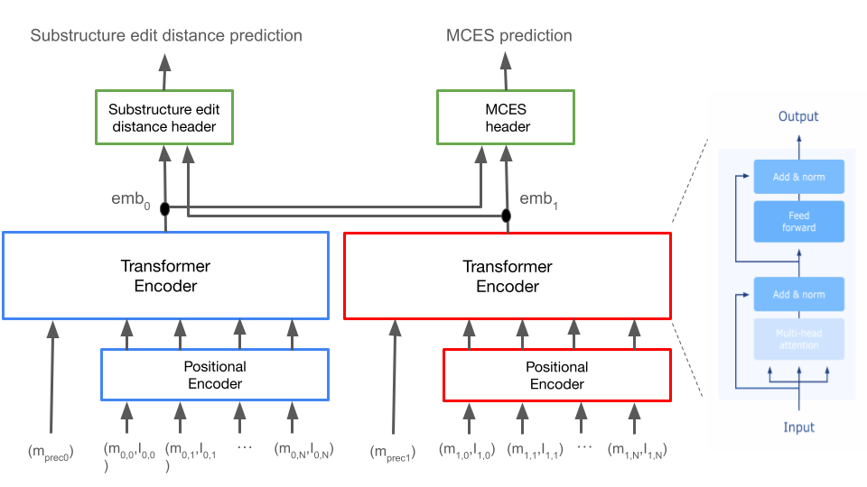

<p align="center">
  
</p>

# SIMBA: Spectral Identification of Molecule Bio-Analogues

**SIMBA** is a transformer-based neural network that accurately predicts chemical structural similarity from tandem mass spectrometry (MS/MS) spectra. Unlike traditional methods relying on heuristic metrics (e.g., modified cosine similarity), SIMBA directly models structural differences, enabling precise analog identification in metabolomics.

SIMBA predicts two interpretable metrics:

1. **Substructure Edit Distance**: Number of molecular graph edits required to convert one molecule into another.
2. **Maximum Common Edge Substructure (MCES) Distance**: Number of bond modifications required to achieve molecular equivalence.

---

## 🚀 Quickstart

### Requirements
- Python 3.11.7
- [Conda](https://docs.conda.io/en/latest/)

### Installation (10–20 minutes)

Create and activate the environment:
```bash
conda env create -f environment.yml
conda activate simba
```

Install the module:
```bash
pip install -e .
```

**Note for macOS users:**
```bash
brew install xz
```

---

## 🔎 Computing Structural Similarities

We provide a pretrained SIMBA model trained on ~300,000 spectra from **NIST20** and **MassSpecGym**. The model operates in positive ionization mode for protonated adducts.

### Usage Example

Follow the [Run Inference Notebook](https://github.com/bittremieux-lab/simba/tree/main/notebooks/final_tutorials/run_inference.ipynb) for a comprehensive tutorial:

- **Runtime:** < 10 minutes (including model/data download)
- **Example data:** [INSERT DATASET LOCATION]
- **Supported format:** `.mgf`

### Performance

Using an Apple M3 Pro (36 GB RAM):
- **Embedding computation:** ~100,000 spectra in ~1 minute
- **Similarity computation:** 1 query vs. 100,000 spectra in ~10 seconds

SIMBA caches computed embeddings, significantly speeding repeated library searches.

<p align="center">
  
</p>

---

## 📚 Training Your Custom SIMBA Model

SIMBA supports training custom models using your own MS/MS datasets in `.mgf` format.

### Step 1: Generate Training Data

Run the script below to generate training data:

```bash
python preprocessing_scripts/final_generation_data.py \
  --spectra_path=/path/to/your/spectra.mgf \
  --workspace=/path/to/output_dir/ \
  --MAX_SPECTRA_TRAIN=100 \
  --mapping_file_name=mapping_unique_smiles.pkl \
  --PREPROCESSING_NUM_WORKERS=0
```

### Output
- Numpy arrays with indexes and structural similarity metrics
- Pickle file (`mapping_unique_smiles.pkl`) mapping spectra indexes to SMILES structures

### Accessing Data Mapping
```python
import pickle

with open('/path/to/output_dir/mapping_unique_smiles.pkl', 'rb') as f:
    data = pickle.load(f)

mol_train = data['molecule_pairs_train']
print(mol_train.df_smiles)
```

### Step 2: Model Training

Train your SIMBA model:

```bash
python training_scripts/final_training.py \
  --CHECKPOINT_DIR=/path/to/checkpoints/ \
  --PREPROCESSING_DIR_TRAIN=/path/to/preprocessed_data/ \
  --TRAINING_NUM_WORKERS=0 \
  --ACCELERATOR=cpu \
  --EPOCHS=100
```

The best-performing model (lowest validation loss) is saved in `CHECKPOINT_DIR`.

---


## 📬 Contact & Support

- **Code repository**: [SIMBA GitHub](https://github.com/bittremieux-lab/simba)
- For questions, issues, or feature requests, please [open an issue](https://github.com/bittremieux-lab/simba/issues).

---

## 📖 References

- SIMBA Paper: [INSERT PAPER LINK or DOI]

---

## 📦 Data Availability

- Training and testing datasets available at: [TO BE DEFINED]

---

